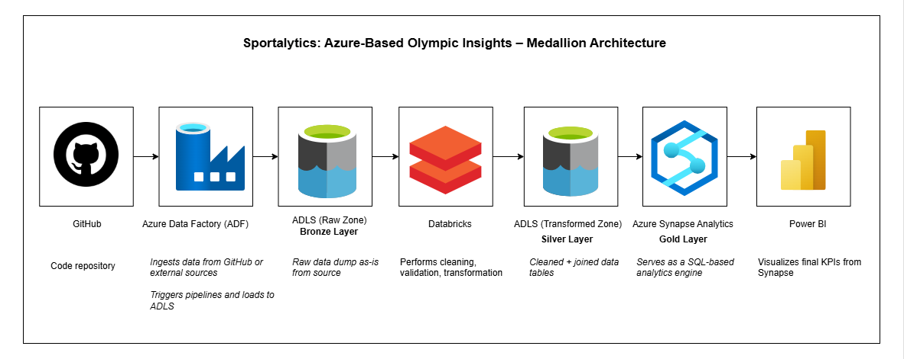
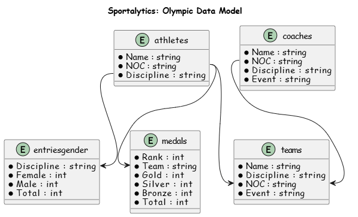
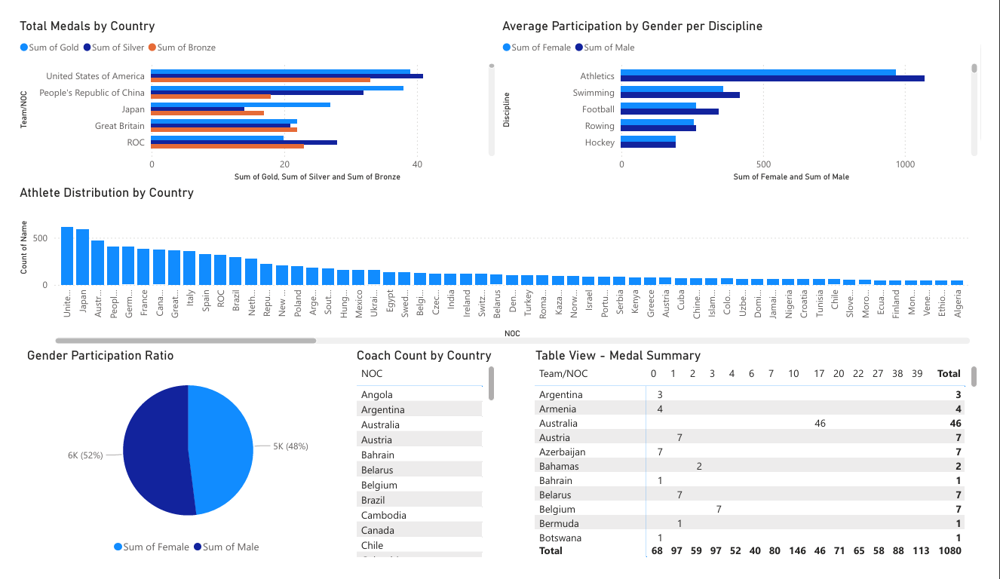
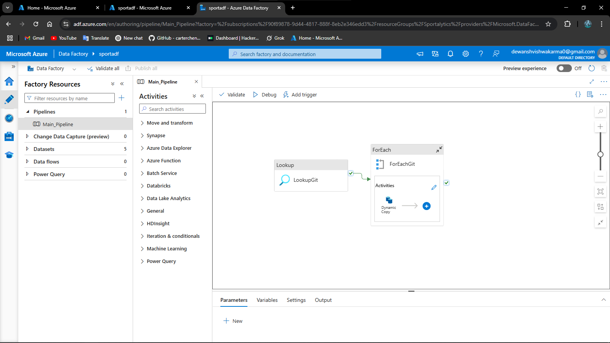

# 🏅 Sportalytics: Azure-Based Olympic Insights

A modern data engineering project leveraging **Azure's cloud ecosystem** and the **Medallion Architecture** (Bronze → Silver → Gold) to analyze and visualize Olympic Games data.

---

## 🧱 Architecture Overview

This project follows the **Medallion Architecture**:

---

### Layer Definitions:
- 🥉 **Bronze Layer**: Raw data ingestion (CSV files from GitHub)
- 🥈 **Silver Layer**: Cleaned and structured data via Databricks
- 🥇 **Gold Layer**: Aggregated KPIs for reporting via Synapse + Power BI

---

## 🔧 Tech Stack

| Component             | Purpose                               |
|-----------------------|---------------------------------------|
| **GitHub**            | Source control for notebooks/scripts  |
| **Azure Data Factory**| Orchestration & ingestion pipelines   |
| **ADLS Gen2**         | Storage for raw and processed data    |
| **Azure Databricks**  | PySpark-based data transformation     |
| **Synapse Analytics** | SQL-based analysis on Gold layer      |
| **Power BI**          | Final dashboards and visualizations   |

---

## 🧩 Data Sources

- `athletes.csv`: Athlete demographics and disciplines
- `medals.csv`: Country-wise medal counts
- `entriesgender.csv`: Gender-based participation
- `coaches.csv`, `teams.csv`: Supporting dimensions

---

## 🧬 Data Model

The relationships among core tables:

---

## 📊 Power BI Dashboard Highlights

- **Total Medals by Country**
- **Athlete Distribution by NOC**
- **Average Participation by Gender per Discipline**
- **Gender Participation Ratio (Pie Chart)**
- **Medal Summary (Matrix View)**

---

## 🚀 How the Pipeline Works

1. GitHub stores the raw CSV files.
2. ADF copies the raw data to **ADLS (Bronze Layer)**.
3. Databricks reads and transforms the data into **Silver Layer**.
4. Aggregated outputs (e.g., total medals) go to **Gold Layer**.
5. Synapse provides an SQL interface for reporting.
6. Power BI connects to Synapse and displays dashboards.

---

## 📸 Screenshots

A visual walkthrough of the Sportalytics data pipeline and dashboard insights.

### 🧪. Databricks Notebook – Data Cleaning & Transformation

Snapshot of your PySpark logic in action.
  
[Databricks Notebook](notebooks/Transformation_Notebook.ipynb)

### 🔄. Azure Data Factory Pipeline

Visual of your ingestion pipeline copying raw data to the Bronze layer.
 

### 🧠. Synapse Analytics SQL Query

SQL query to generate medal summaries or participation statistics from the Gold layer. 

---
